```{=html}
<section class="hero-artwork">
  
</section>

<section class="home-intro">
  <div class="home-intro-grid">

    <div class="home-intro-main">
      <div class="hero-kicker">
        <span class="hero-title">Weldy Lab</span>
        <span class="hero-sep"> | </span>
        <span class="hero-subtitle">Genes · RNA · Hearts · Medicine</span>
      </div>

      <div class="hero-tagline">
        From genetic discovery to cardiovascular innovation
      </div>

      <div class="home-intro-text">
        The Weldy Lab is an independent research group at Stanford University that integrates human genetics, epigenetics, RNA biology, and vascular biology to uncover causal mechanisms of cardiovascular disease and advance new therapeutic strategies.
      </div>

      <div class="home-intro-text home-intro-text-secondary">
        Using single-cell genomics, molecular biology, and in vivo models, we study how genetic variation shapes vascular cell behavior, inflammation, and disease risk.
      </div>

      <div class="hero-buttons">
        <a class="btn btn-primary" href="research.qmd">Research</a>
        <a class="btn btn-outline-primary" href="people.qmd">People</a>
        <a class="btn btn-outline-secondary" href="join.qmd">Join</a>
      </div>

      <div class="stanford-line">
        <div class="stanford-text">
          <div><strong>Chad S. Weldy, MD, PhD</strong></div>
          <div>Principal Investigator</div>
          <div>Assistant Professor (Incoming), Department of Medicine</div>
          <div>Division of Cardiovascular Medicine, Stanford University</div>
        </div>
      </div>
    </div>

    <div class="home-intro-side">
      <div class="home-logo-card">
        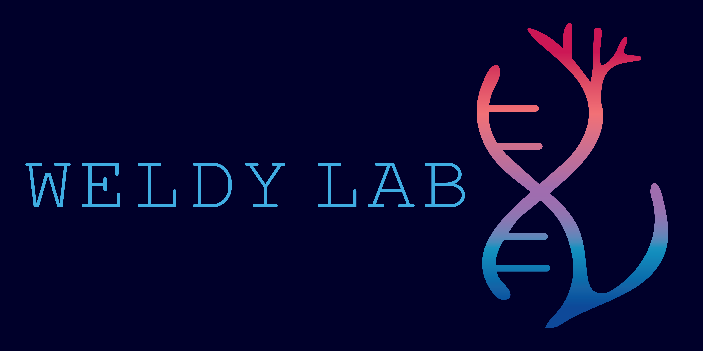

        
      </div>
    </div>

  </div>
</section>

```

---

## From genetic discovery to cardiovascular innovation

::: {.mission-quote}
> **Lab Mission** *The Weldy Lab seeks to transform cardiovascular medicine by integrating human genetics with mechanistic biology to uncover causal pathways of disease and pioneer new therapeutic strategies.*
:::

---

## Defining genetic mechanisms of cardiovascular disease

::: {.columns .v-center}

::: {.column width="38%"}
{width=100% style="border-radius:10px;"}
:::

::: {.column width="62%"}

The Weldy Lab studies how human genetic variation drives vascular dysfunction, inflammation, and cardiovascular disease. We integrate human genetics, epigenetics, single-cell genomics, RNA biology, and experimental models to define causal mechanisms and identify new therapeutic opportunities.

Led by **Chad S. Weldy, MD, PhD**, the lab focuses on questions at the intersection of cardiovascular genetics, vascular biology, and RNA-mediated regulation, with particular interest in smooth muscle cell phenotypic modulation, innate immune signaling, and mechanisms of disease susceptibility governed by epigenetic memory.

Our work is grounded in the idea that genetic discovery can do more than identify risk. It can reveal the biology that matters most and point toward more precise strategies for prevention and treatment.

[Learn more about Dr. Weldy →](people/chad-weldy.qmd)

:::
:::

---

## Featured publications

::: {.columns .v-center}
::: {.column width="30%" .cover-column}
[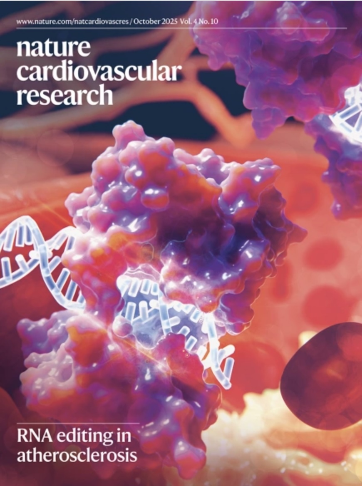{width=100%}](https://doi.org/10.1038/s44161-025-00710-5)
:::

::: {.column width="70%"}
### Smooth muscle cell ADAR1 controls activation of RNA sensor MDA5 in atherosclerosis

**Weldy CS**, et al. *Nature Cardiovascular Research* (2025)  
DOI: 10.1038/s44161-025-00710-5

A smooth muscle–specific RNA editing program regulates dsRNA sensing and inflammatory signaling in atherosclerosis, linking RNA biology to vascular disease mechanisms.

[Read the paper →](https://doi.org/10.1038/s44161-025-00710-5)
:::
:::

::: {.columns .v-center}
::: {.column width="30%" .cover-column}
[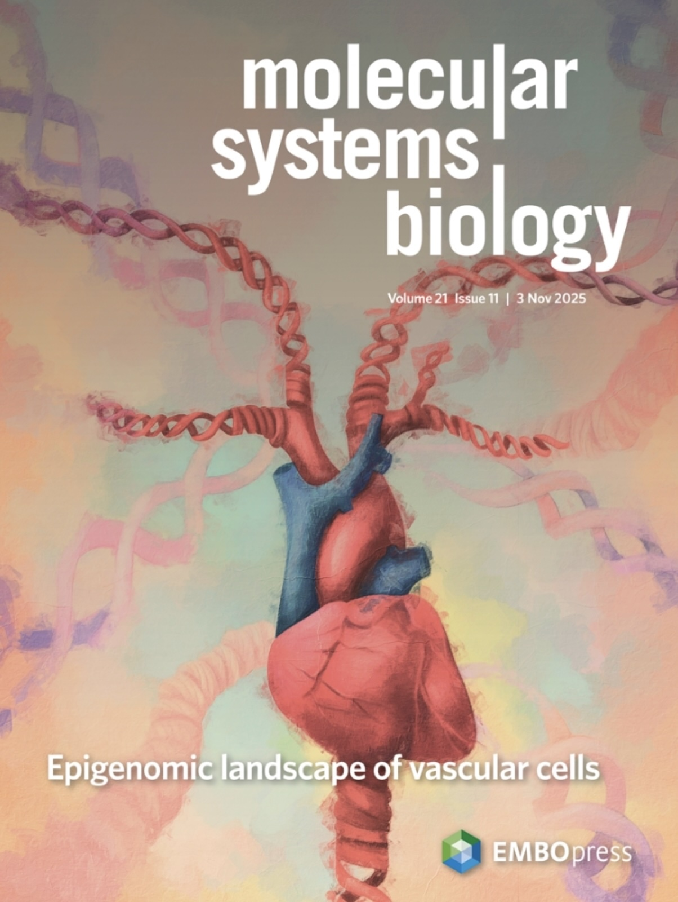{width=100%}](https://doi.org/10.1038/s44320-025-00140-2)
:::

::: {.column width="70%"}
### Epigenomic landscape of single vascular cells reflects developmental origin and disease risk loci

**Weldy CS**, et al. *Molecular Systems Biology* (2025)  
DOI: 10.1038/s44320-025-00140-2

Single-cell epigenomic profiling reveals how developmental origin shapes vascular cell states and maps aortic dimension and aneurysm risk loci to specific cell type and vascular site specific programs across smooth muscle, endothelial, and fibroblast cell types.

[Read the paper →](https://doi.org/10.1038/s44320-025-00140-2)
:::
:::

---

## Areas of focus
- Human genetics & causality
- Vascular biology & site-specific mechanisms
- Epigenetics and epigenetic memory
- RNA biology (A-to-I editing) and innate immune sensing
- Single-cell and multi-omics approaches

---

## RNA editing and double-stranded RNA sensing

::: {.columns .v-center}

::: {.column width="60%"}

*RNA editing by ADAR enzymes is a fundamental mechanism that allows cells to distinguish self from non-self RNA.*  

Through A-to-I editing of double-stranded RNA, ADAR1 reshapes endogenous RNA structures and prevents inappropriate activation of the innate immune sensor MDA5 (gene symbol *IFIH1*).

Genetic and molecular studies now show that reduced RNA editing increases inflammatory signaling and disease risk, including coronary artery disease. Our work demonstrates that impaired ADAR1-mediated editing in vascular smooth muscle cells leads to pathologic dsRNA sensing, identifying endogenous RNA recognition as a causal mechanism of vascular disease.

By integrating human genetics, RNA biology, and vascular models, we study how variation in RNA editing and activation of dsRNA sensing programs connects genetic risk to inflammation and cardiovascular pathology.

[Learn more about our RNA editing research →](research.qmd)

:::

::: {.column width="40%"}

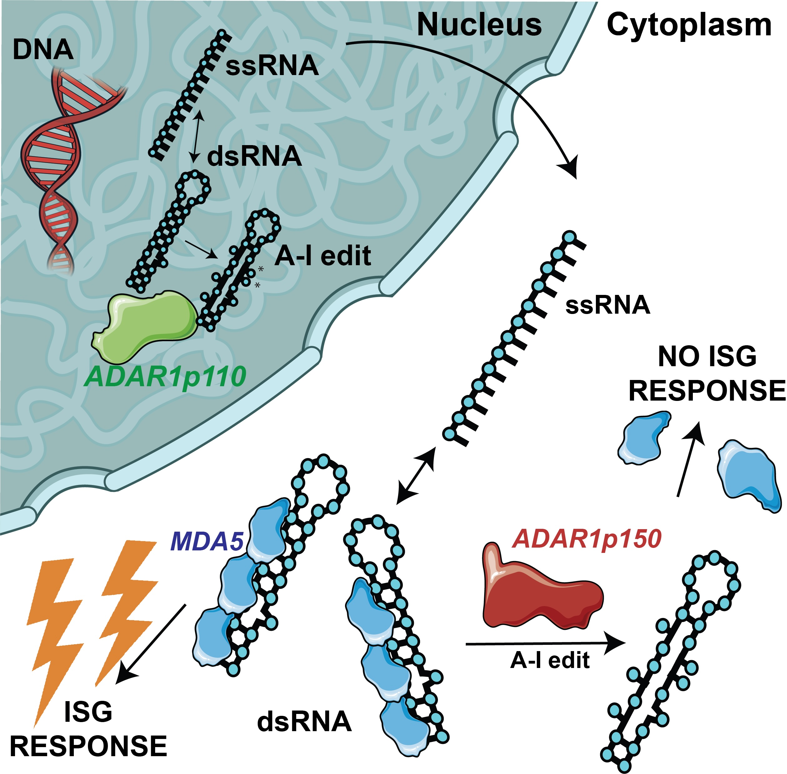{width=100% style="border-radius:10px;"}
*ADAR1-mediated RNA editing suppresses endogenous dsRNA sensing by MDA5 in vascular cells.*

*Recently reviewed by Weldy et al. ATVB, 2026 [Read the paper →](https://www.ahajournals.org/doi/10.1161/ATVBAHA.125.323847)* 

:::

:::

---

## News
[See lab updates →](news/)

::: {.columns .v-center}
::: {.column width="25%"}
[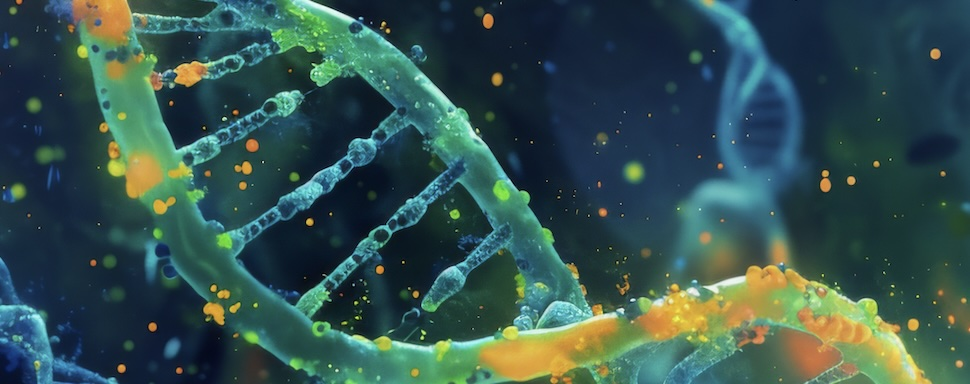{width=100% style="border-radius:8px;"}](news/2024-11-16-stanford-medicine-rna-editing.html)
:::
::: {.column width="75%"}
### Stanford Medicine highlights our RNA editing work
A Stanford Medicine feature on ADAR1 RNA editing, dsRNA sensing, and implications for cardiovascular disease mechanisms.  
[Read the story →](news/2024-11-16-stanford-medicine-rna-editing.html)
:::
:::

::: {.columns .v-center}
::: {.column width="25%"}
[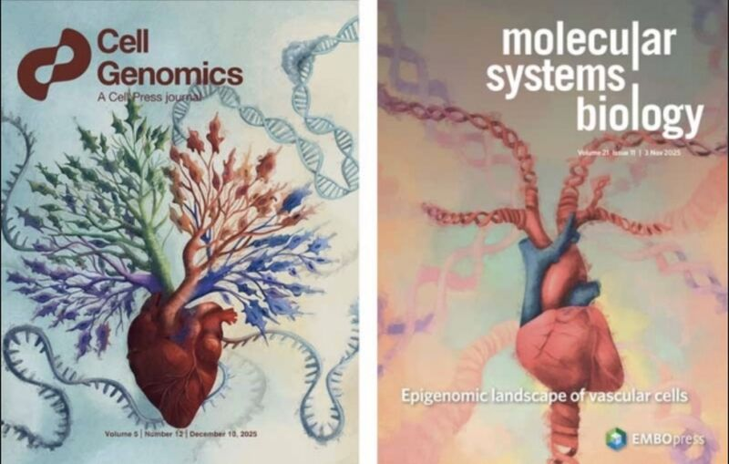{width=100% style="border-radius:8px;"}](news/2025-12-15-developmental-memory-arteries.html)
:::
::: {.column width="75%"}
### Stanford CVI story on developmental “memory” in arteries
How developmental origin leaves a lasting imprint shaping regional vascular disease risk.  
[Read the story →](news/2025-12-15-developmental-memory-arteries.html)
:::
:::

---

## Affiliations

::: {.columns}
::: {.column width="50%"}
{style="max-height:110px; width:100%; object-fit:contain;"}
:::
::: {.column width="50%"}
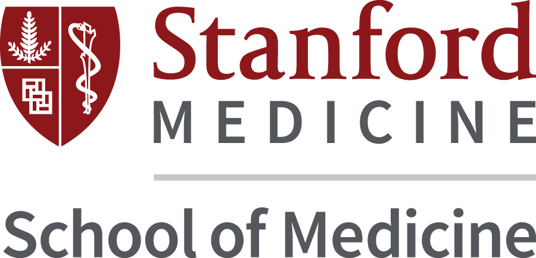{style="max-height:110px; width:100%; object-fit:contain;"}
:::
:::

::: {.columns}
::: {.column width="50%"}
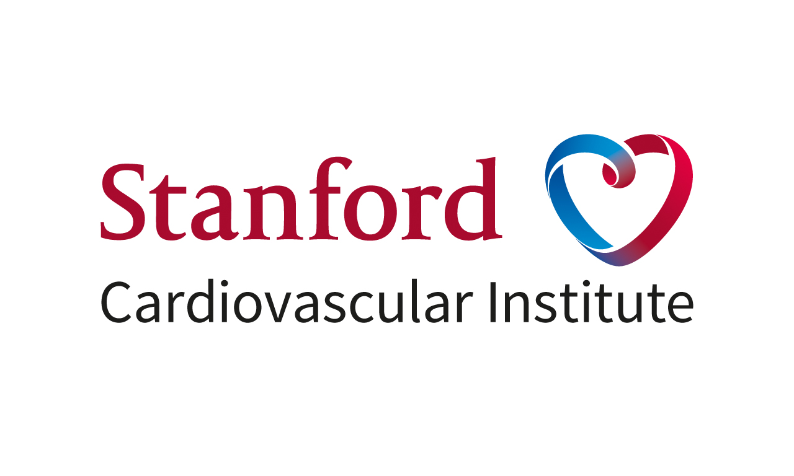{style="max-height:110px; width:100%; object-fit:contain;"}
:::
::: {.column width="50%"}
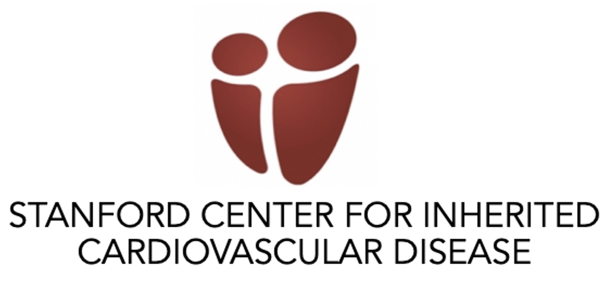{style="max-height:110px; width:100%; object-fit:contain;"}
:::
:::

---

## Funding

::: {.columns}
::: {.column width="50%"}
{style="max-height:110px; width:100%; object-fit:contain;"}
:::
::: {.column width="50%"}
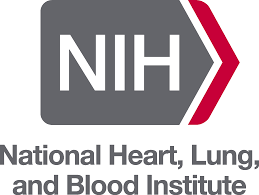{style="max-height:110px; width:100%; object-fit:contain;"}
:::
:::

::: {.columns}
::: {.column width="50%"}
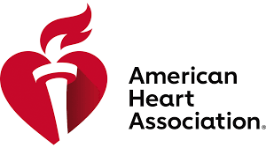{style="max-height:110px; width:100%; object-fit:contain;"}
:::
::: {.column width="50%"}
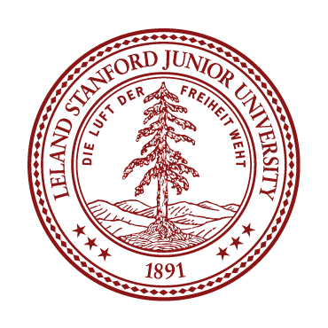{style="max-height:110px; width:100%; object-fit:contain;"}
:::
:::

