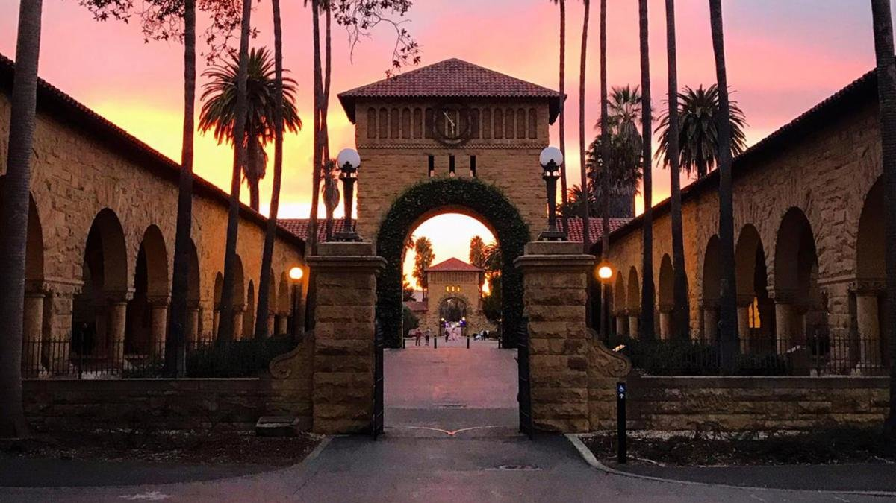

## Open positions

We are actively recruiting founding members of the lab:

- **Postdoctoral Fellow – RNA Biology and Cardiovascular Disease**  
- **Lab Technician / Lab Manager – Cardiovascular Genomics and Molecular Biology**  
- Graduate students  
- Research assistants  
- Clinician-scientist trainees  

We are particularly excited to build a team of highly motivated individuals interested in leveraging *human genetics, RNA biology, and vascular biology* to uncover causal mechanisms of cardiovascular disease.

---

## Featured Opportunities

### **Postdoctoral Fellow**

We are seeking a postdoctoral fellow to lead an interdisciplinary project investigating how A-to-I RNA editing by ADAR1 regulates double-stranded RNA sensing and innate immune activation in atherosclerosis.

This work integrates:
- Mouse models of vascular disease  
- Single-cell genomics (scRNA-seq, scATAC-seq)  
- Epigenetic memory and innate immune signaling  
- In vitro molecular and cellular biology  

This position is ideal for candidates seeking to drive a high-impact, independent research program at the interface of RNA biology, epigenetics, immunology, and cardiovascular disease, with strong mentorship toward independence.

---

### **Lab Technician / Lab Manager**

We are seeking a highly organized and motivated individual to play a central role in building and managing lab operations while contributing to research.

Core responsibilities include:
- Establishing lab infrastructure and workflows  
- Managing ordering, inventory, and compliance  
- Supporting molecular biology, cell culture, and mouse experiments  

This position is ideal for candidates who want both operational leadership experience and scientific growth. The lab is highly supportive of individuals developing their own research projects, with opportunities for mentorship, skill development, and authorship.

---

## Why join the Weldy Lab?

The Weldy Lab is a growing research group at Stanford University focused on uncovering *causal mechanisms of cardiovascular disease* by integrating *human genetics*, *RNA biology*, and *vascular biology*.

As a new laboratory, we offer a uniquely *close-mentorship environment* where trainees work directly with the PI on high-impact, interdisciplinary projects at the interface of *basic science, genomics, and clinical medicine*.

### What makes training in the Weldy Lab distinctive?

**• Direct, hands-on mentorship**  
Trainees receive close, individualized mentorship with regular access to the PI for experimental design, data interpretation, writing, and career development. Training is tailored to your background, goals, and career stage.

**• Clinically grounded science**  
Our work is motivated by real unmet needs in cardiovascular medicine. Projects are rooted in human genetics and patient-relevant biology, with an emphasis on causal inference and translational impact.

**• Interdisciplinary training at Stanford**  
The lab is embedded within Stanford’s Division of Cardiovascular Medicine and closely connected to the Stanford Cardiovascular Institute, the Center for Inherited Cardiovascular Disease, and the broader Stanford genomics ecosystem.

**• Ownership and independence**  
Trainees are encouraged to take intellectual ownership of their projects, lead manuscripts, and develop a clear scientific identity. Early members of the lab help shape new directions and build the lab’s foundation.

**• A supportive, transparent lab culture**  
We aim to foster an environment rooted in mutual respect, curiosity, and enthusiasm for science and medicine. Expectations are clear, communication is open, and mentorship evolves as trainees grow.

---

### Who should consider joining?

We are excited to work with individuals who:

- Are curious about the genetic and molecular basis of cardiovascular disease  
- Enjoy interdisciplinary science and learning new approaches  
- Value close mentorship and collaboration  
- Are motivated to develop independence and scientific ownership  

---

### Learn more about mentorship

Our approach to mentorship is shaped by a non-linear path through science and medicine and a deep belief that *the right support, at the right time, for the right person* is essential for growth.

👉 **[Read more about mentorship in the Weldy Lab →](mentorship.qmd)**

---

### How to apply

To apply, please email:
- Curriculum vitae  
- Brief statement of interests and career goals  

to **weldyc@stanford.edu**

Please include a short note describing your background, what excites you about the lab, and which position you are interested in.

---

{
  width=100%
  style="border-radius:16px; margin-top:2rem;"
}
