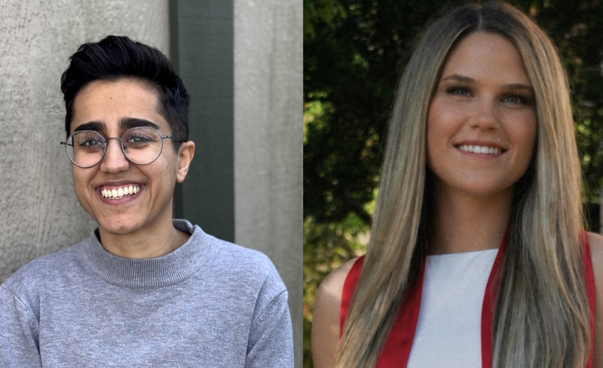

---
title: "The Weldy Lab welcomes two new lab members"
date: 2026-07-08
categories: ["News", "Lab News", "People"]
image: ../images/laila-elissa.jpg
---

{fig-align="center" width=85%}

The Weldy Lab is excited to welcome **Dr. Laila Rad** and **Elissa Oliver** as the first members of our growing research team.

Their arrival marks an exciting milestone for the lab as we build a collaborative research program focused on uncovering the genetic and molecular mechanisms of cardiovascular disease.

## Welcome, Laila!

**Laila Rad, PhD**, joins the Weldy Lab as a Postdoctoral Fellow in the Division of Cardiovascular Medicine at Stanford University.

Laila received her Ph.D. in Biomedical Engineering from the University of Michigan, where her research focused on developing biomaterial-based approaches for the treatment and diagnosis of food allergy and autoimmune disease.

In the Weldy Lab, Laila will combine her background in **immunology, bioinformatics, and biomaterials** to investigate how RNA sensing and innate immune activation contribute to vascular cell dysfunction and atherosclerosis.

**Learn more about Laila →**  
[Meet Laila Rad](../people/laila-rad.qmd)

## Welcome, Elissa!

**Elissa Oliver** joins the Weldy Lab as a **Life Science Research Professional 1**.

Elissa earned her B.S. in Biochemistry and Molecular Biology from the University of Georgia. Her undergraduate research in the Funato Laboratory focused on the molecular biology of pediatric high-grade glioma, where she gained experience in molecular and cellular biology, fluorescence microscopy, and mouse models of disease.

In the Weldy Lab, Elissa will apply her background in molecular biology and translational science to studies investigating how RNA sensing and innate immune signaling influence vascular cell behavior and the development of cardiovascular disease.

**Learn more about Elissa →**  
[Meet Elissa Oliver](../people/elissa-oliver.qmd)

