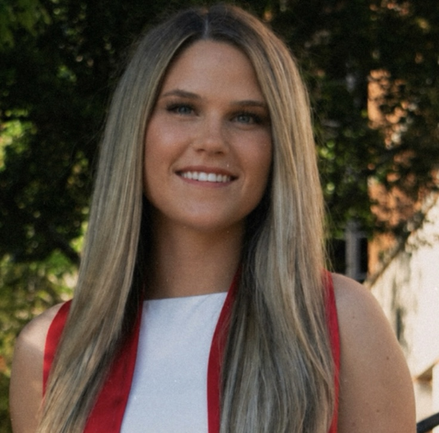

---
title: "Elissa Oliver, B.S."
subtitle: "Life Science Research Professional 1"
order: 3
image: /images/elissa-oliver.jpg
description: |
  Molecular Biology · Translational Science · Vascular Biology 
  <em>Read more →</em>

---

{width=100% style="border-radius:10px;"}

### Bio

Elissa earned her B.S. in Biochemistry and Molecular Biology from the University of Georgia. As an undergraduate researcher in the Funato Laboratory, she studied the molecular biology of pediatric high-grade glioma and gained experience in mammalian cell culture, immunohistochemistry, fluorescence microscopy, molecular biology techniques, and mouse models of disease. She is a co-first author on a peer-reviewed publication investigating mechanisms of glioma tumorigenesis.

In addition to her research experience, Elissa worked as an emergency department medical scribe, where she developed a strong clinical foundation through close collaboration with physicians and multidisciplinary care teams. Her combined research and clinical experiences have shaped her interest in **translational medicine and the molecular mechanisms underlying human disease**.

In the Weldy Lab, Elissa applies her background in molecular and cellular biology to investigate how RNA sensing and innate immune activation influence vascular cell behavior and the development of atherosclerosis.

