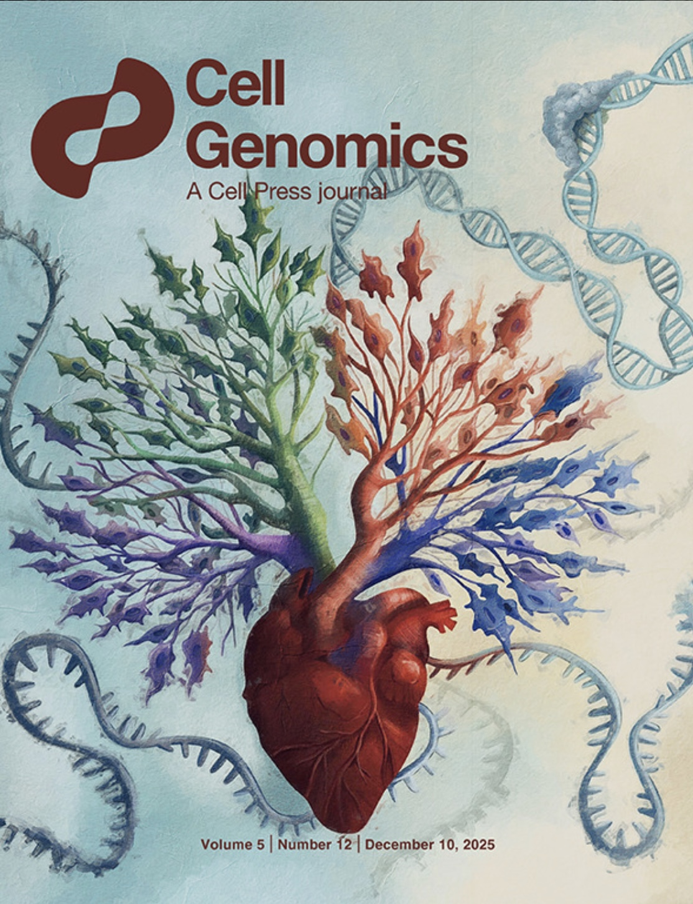
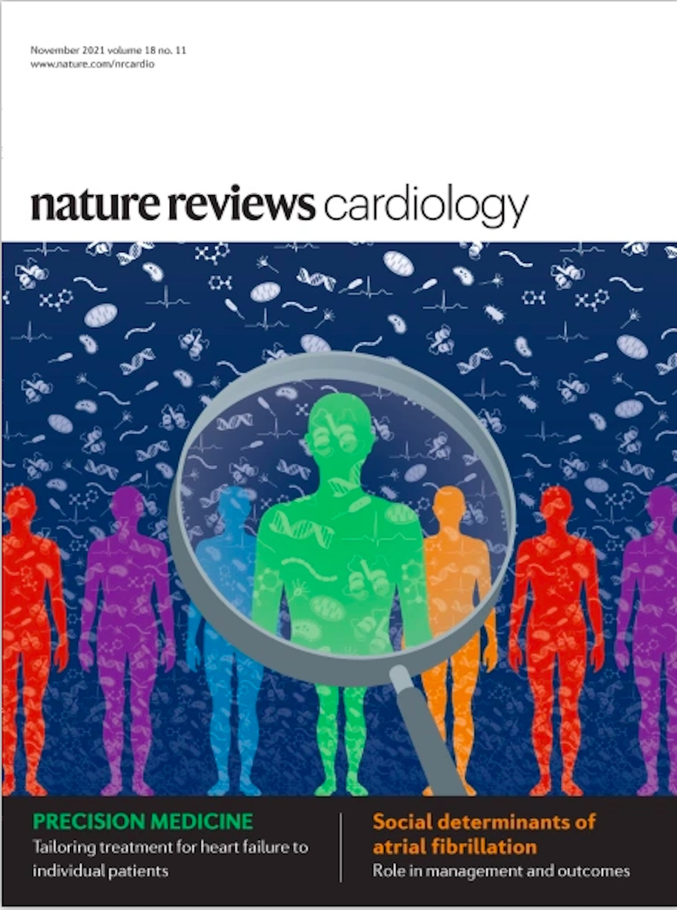

## Featured publications

::: {.columns}
::: {.column width="25%"}
[{width=100% style="border-radius:6px;"}](https://doi.org/10.1038/s44161-025-00710-5)
:::
::: {.column width="25%"}
[{width=100% style="border-radius:6px;"}](https://doi.org/10.1038/s44320-025-00140-2)
:::
::: {.column width="25%"}
[{width=100% style="border-radius:6px;"}](https://doi.org/10.1016/j.xgen.2025.101034)
:::
::: {.column width="25%"}
[{width=100% style="border-radius:6px;"}](https://doi.org/10.1038/s41569-021-00566-9)
:::
:::

## Selected publications

My work integrates cardiovascular genetics, RNA biology, vascular biology, and functional genomics to define causal mechanisms of disease and identify therapeutic targets.

---

### RNA biology, vascular smooth muscle, and atherosclerosis  
Mechanistic studies defining how RNA editing and innate immune sensing regulate vascular disease.

1. **Weldy, C. S.**, Li, Q., Monteiro, J. P., Peters T. S., Guo, H., Galls, D., Gu, W., Cheng, P. P., Ramste, M., Li, D., Palmisano, B. P., Sharma, D., Worssam, M., Zhao, Q., Bhate, A., Kundu, R., Nguyen, T., Mokry, M., Miller, C. L., van der Laan, S. W., Li, J. B., Quertermous, T. (2025). Smooth muscle cell expression of RNA editing enzyme ADAR1 controls activation of RNA sensor MDA5 in atherosclerosis. *Nature Cardiovascular Research*. PMID: 40958051. [doi:10.1038/s44161-025-00710-5](https://doi.org/10.1038/s44161-025-00710-5)

2. **Weldy, C. S.**, Li, J. B., Quertermous, T. (2026). Adenosine-to-inosine (A-to-I) RNA editing by ADAR1 to control RNA sensing in cardiovascular disease. *Arteriosclerosis, Thrombosis, and Vascular Biology*, 46, e323847. PMID: 41744067; PMCID: PMC12948147. [doi:10.1161/ATVBAHA.125.323847](https://doi.org/10.1161/ATVBAHA.125.323847)

3. Damiani, I., Solberg, E. H., Iyer, M., Cheng, P., **Weldy, C. S.** •, Kim, J. B. • (•Co-senior author). (2025). Environmental pollutants and atherosclerosis: epigenetic mechanisms linking genetic risk and disease. *Atherosclerosis*. [doi:10.1016/j.atherosclerosis.2025.119131](https://doi.org/10.1016/j.atherosclerosis.2025.119131)

4. Quertermous, T., Li, D., **Weldy, C. S.**, Ramste, M. O., Sharma, D., Monteiro, J. P., Gu, W., Worssam, M., Palmisano, B., Park, C., Cheng, P. (2024). Genome wide genetic associations prioritize evaluation of causal mechanisms of atherosclerotic disease risk. *Arteriosclerosis, Thrombosis, and Vascular Biology*.

5. Shi, H., Nguyen, T., Zhao, Q., Cheng, P., Sharma, D., Kim, H.-J., Kim, J. B., Wirka, R., **Weldy, C. S.**, Monteiro, J. P., Quertermous, T. (2023). Discovery of transacting long noncoding RNAs that regulate smooth muscle cell phenotype. *Circulation Research*.

6. Kim, H.-J., Cheng, P., Travisano, S., **Weldy, C.**, Monteiro, J. P., Kundu, R., Nguyen, T., Sharma, D., Shi, H., Lin, Y., Liu, B., Haldar, S., Jackson, S., Quertermous, T. (2023). Molecular mechanisms of coronary artery disease risk at the *PDGFD* locus. *Nature Communications*, 14, 847.

---

### Functional genomics, single-cell biology, and vascular disease risk  
Single-cell and multi-omic approaches to define cell-type-specific mechanisms of cardiovascular disease.

1. Zhao, Q., Pedroza, A., Sharma, D., Gu, W., Dalal, A., **Weldy, C. S.**, Jackson, W., Li, D. Y., Ryan, Y., Nguyen, T., Shad, R., Palmisano, B., Monteiro, J., Worssam, M., Berezowitz, A., Iyer, M., Shi, H., Kundu, R., Limbu, L., Kim, J. B., Kundaje, A., Fischbein, M., Wirka, R., Quertermous, T., Cheng, P. (2025). A cell and transcriptomic atlas of human arterial vasculature. *Cell Genomics*. PMID: 41086809. [doi:10.1016/j.xgen.2025.101034](https://doi.org/10.1016/j.xgen.2025.101034)

2. **Weldy, C. S.**, Kundu, S., Monteiro, J., Gu, W., Pedroza, A. J., Dalal, A. R., Worssam, M., Palmisano, B., Zhao, Q., Sharma, D., Nguyen, T., Kundu, R., Fischbein, M. P., Engreitz, J., Kundaje, A. B., Cheng, P. P., Quertermous, T. (2025). Epigenomic landscape of single vascular cells reflects developmental origin and disease risk loci. *Molecular Systems Biology*. PMID: 40931195. [doi:10.1038/s44320-025-00140-2](https://doi.org/10.1038/s44320-025-00140-2)

3. Li, D. Y., Kundu, S., Cheng, P., Gu, W., Jackson, W., Zhao, Q., Nguyen, T., Worssam, M., Monteiro, J., Caceres, R., Dale, S., Palmisano, B., **Weldy, C.** *, Kundu, R., Kundaje, A., Wirka, R., Quertermous, T. (2026). Vascular smooth muscle cell atherosclerosis trajectories characterized at single cell resolution identify causal transcriptomic and epigenomic mechanisms of disease risk. *Nature Communications*. [doi:10.1038/s41467-026-70530-z](https://doi.org/10.1038/s41467-026-70530-z)

4. Engreitz, J., … **Weldy, C. S.**, … Samer, E. K. (2024). Deciphering the impact of genomic variation on function. *Nature*.

5. Wang, Q., Tang, T. M., Youlton, N., **Weldy, C. S.**, Kenney, A. M., Ronen, O., Hughes, J. W., Chin, E. T., Sutton, S. C., Agarwal, A., Li, X., Behr, M., Kumbier, K., Moravec, C. S., Tang, W. H. W., Margulies, K. B., Cappola, T. P., Butte, A. J., Arnaout, R. A., Brown, J. B., Priest, J. R., Parikh, V. N., Yu, B., Ashley, E. A. (2025). Epistasis regulates genetic control of cardiac hypertrophy. *Nature Cardiovascular Research*, 4, 740–760.

---

### Precision cardiology and inherited cardiovascular disease  
Clinical and translational studies advancing precision cardiovascular medicine.

1. Kim, D., Chu, E., Keamy-Minor, E., Paranjpe, I., Tang, W., O’Sullivan, J., Desai, Y., Liu, M., Munsey, E., Hecker, K., Cuenco, I., Kao, B., Bacolor, E., Bonnett, C., Linder, A., Lacar, K., Robles, N., Lamendola, C., Smith, A., Knowles, J., Perez, M., Kawana, T., Sallam, K., **Weldy, C. S.** •, Wheeler, M. •, Parikh, V. •, Salisbury, H. •, Ashley, E. • (•Co-senior author). (2024). One-year real-world experience with mavacamten and its physiologic effects on obstructive hypertrophic cardiomyopathy. *Frontiers in Cardiovascular Medicine*. PMID: 39314763. [doi:10.3389/fcvm.2024.1429230](https://doi.org/10.3389/fcvm.2024.1429230)

2. **Weldy, C. S.**, Perez, M. V. (2023). From founder to function: can we unravel phenotype from genotype? *Heart Rhythm*.

3. **Weldy, C. S.**, Ashley, E. A. (2021). Towards precision medicine in heart failure. *Nature Reviews Cardiology*. [doi:10.1038/s41569-021-00566-9](https://doi.org/10.1038/s41569-021-00566-9)

4. **Weldy, C. S.**, Ashley, E. A. (2021). Mulibrey nanism and the real-time use of genome and biobank engines to inform clinical care in an ultrarare disease. *Circulation: Genomic and Precision Medicine*. [doi:10.1161/circgen.121.003430](https://doi.org/10.1161/circgen.121.003430)

5. **Weldy, C. S.**, Murtha, R., Kim, J. B. (2022). Dissecting the genomics of spontaneous coronary artery dissection. *Circulation: Genomic and Precision Medicine*. [doi:10.1161/circgen.122.003867](https://doi.org/10.1161/circgen.122.003867)

---

### Earlier foundational studies

1. **Weldy, C.**, Syed, S., Amsallem, M., Hu, D., Ji, X., Punn, R., Taylor, A., Navarre, B., Reddy, S. (2020). Circulating whole genome miRNA expression corresponds to progressive right ventricle enlargement and systolic dysfunction in adults with tetralogy of Fallot. *PLOS ONE*, 15(11), e0241476. [doi:10.1371/journal.pone.0241476](https://doi.org/10.1371/journal.pone.0241476)

2. Goodson, J. M., **Weldy, C. S.**, MacDonald, J. W., Liu, Y., Bammler, T. K., Chien, W.-M., Chin, M. T. (2017). In utero exposure to diesel exhaust particulates is associated with an altered cardiac transcriptional response to transverse aortic constriction and altered DNA methylation. *FASEB Journal*.

3. Liu, Y., **Weldy, C. S.**, Chin, M. T. (2016). Neonatal diesel exhaust particulate exposure does not predispose mice to adult cardiac hypertrophy or heart failure. *International Journal of Environmental Research and Public Health*, 13(12), 1178. [doi:10.3390/ijerph13121178](https://doi.org/10.3390/ijerph13121178)

4. Hartman, M. E., Liu, Y., Zhu, W.-Z., Chien, W.-M., **Weldy, C. S.**, Fishman, G. I., et al. (2014). Myocardial deletion of transcription factor CHF1/Hey2 results in altered myocyte action potential and mild conduction system expansion but does not alter conduction system function or promote spontaneous arrhythmias. *FASEB Journal*, 28(7), 3007–3015. [doi:10.1096/fj.14-251728](https://doi.org/10.1096/fj.14-251728)

5. **Weldy, C. S.**, Liu, Y., Liggitt, H. D., Chin, M. T. (2014). In utero exposure to diesel exhaust air pollution promotes adverse intrauterine conditions, resulting in weight gain, altered blood pressure, and increased susceptibility to heart failure in adult mice. *PLOS ONE*, 9(2), e88582. [doi:10.1371/journal.pone.0088582](https://doi.org/10.1371/journal.pone.0088582)

6. **Weldy, C. S.**, Liu, Y., Chang, Y.-C., Medvedev, I. O., Fox, J. R., Larson, T. V., et al. (2013). In utero and early life exposure to diesel exhaust air pollution increases adult susceptibility to heart failure in mice. *Particle and Fibre Toxicology*, 10(1), 59. [doi:10.1186/1743-8977-10-59](https://doi.org/10.1186/1743-8977-10-59)

7. Liu, Y., Chien, W.-M., Medvedev, I. O., **Weldy, C. S.**, Luchtel, D. L., Rosenfeld, M. E., Chin, M. T. (2013). Inhalation of diesel exhaust does not exacerbate cardiac hypertrophy or heart failure in two mouse models of cardiac hypertrophy. *Particle and Fibre Toxicology*, 10(1), 49. [doi:10.1186/1743-8977-10-49](https://doi.org/10.1186/1743-8977-10-49)

8. **Weldy, C. S.**, Luttrell, I. P., White, C. C., Morgan-Stevenson, V., Cox, D. P., Carosino, C. M., et al. (2013). Glutathione (GSH) and the GSH synthesis gene *Gclm* modulate plasma redox and vascular responses to acute diesel exhaust inhalation in mice. *Inhalation Toxicology*, 25(8), 444–454. [doi:10.3109/08958378.2013.801004](https://doi.org/10.3109/08958378.2013.801004)

9. McConnachie, L. A., Botta, D., White, C. C., **Weldy, C. S.**, Wilkerson, H.-W., Yu, J., et al. (2013). The glutathione synthesis gene *Gclm* modulates amphiphilic polymer-coated CdSe/ZnS quantum dot-induced lung inflammation in mice. *PLOS ONE*, 8(5), e64165. [doi:10.1371/journal.pone.0064165](https://doi.org/10.1371/journal.pone.0064165)

10. **Weldy, C. S.**, Luttrell, I. P., White, C. C., Morgan-Stevenson, V., Bammler, T. K., Beyer, R. P., et al. (2012). Glutathione (GSH) and the GSH synthesis gene *Gclm* modulate vascular reactivity in mice. *Free Radical Biology and Medicine*, 53(6), 1264–1278. [doi:10.1016/j.freeradbiomed.2012.07.006](https://doi.org/10.1016/j.freeradbiomed.2012.07.006)

11. **Weldy, C. S.**, White, C. C., Wilkerson, H.-W., Larson, T. V., Stewart, J. A., Gill, S. E., et al. (2011). Heterozygosity in the glutathione synthesis gene *Gclm* increases sensitivity to diesel exhaust particulate induced lung inflammation in mice. *Inhalation Toxicology*, 23(12), 724–735. [doi:10.3109/08958378.2011.608095](https://doi.org/10.3109/08958378.2011.608095)

12. **Weldy, C. S.**, Wilkerson, H.-W., Larson, T. V., Stewart, J. A., Kavanagh, T. J. (2011). DIESEL particulate exposed macrophages alter endothelial cell expression of eNOS, iNOS, MCP1, and glutathione synthesis genes. *Toxicology in Vitro*, 25(8), 2064–2073. [doi:10.1016/j.tiv.2011.08.008](https://doi.org/10.1016/j.tiv.2011.08.008)

---

## Full publication list

For a complete and continuously updated list of publications:

- [Google Scholar](<https://scholar.google.com/citations?hl=en&user=N7EA0CQAAAAJ&view_op=list_works&sortby=pubdate>)
- [PubMed](<https://www.ncbi.nlm.nih.gov/myncbi/chad.weldy.1/bibliography/public/>)
- [ORCID](<https://orcid.org/0000-0003-4652-6422>)
