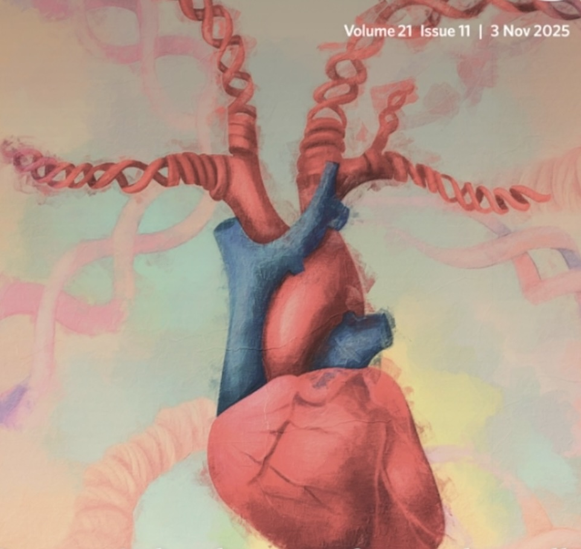
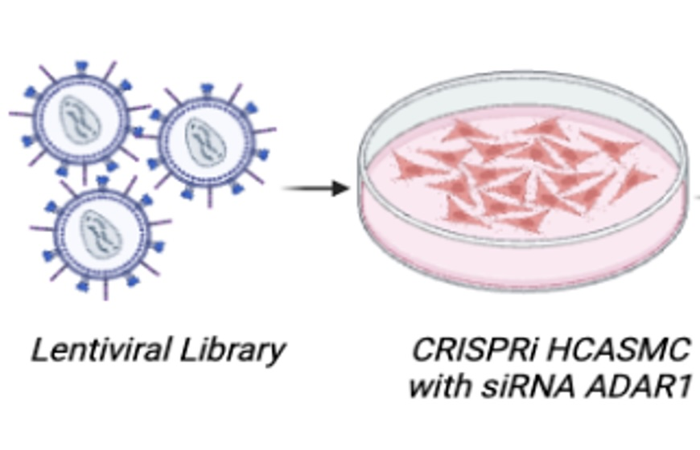
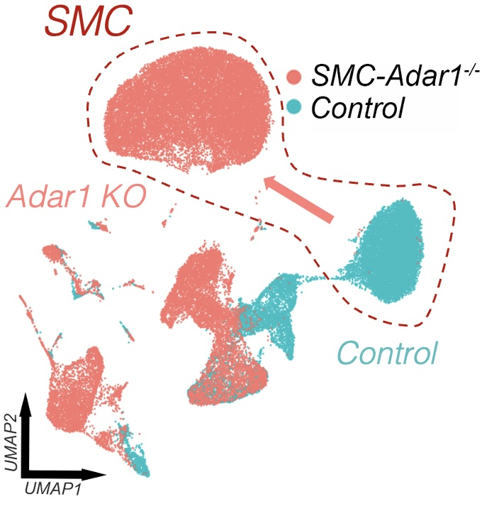
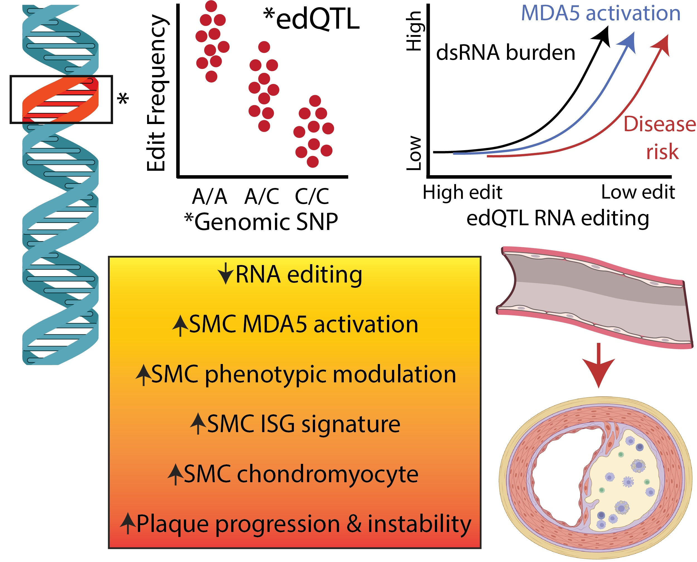
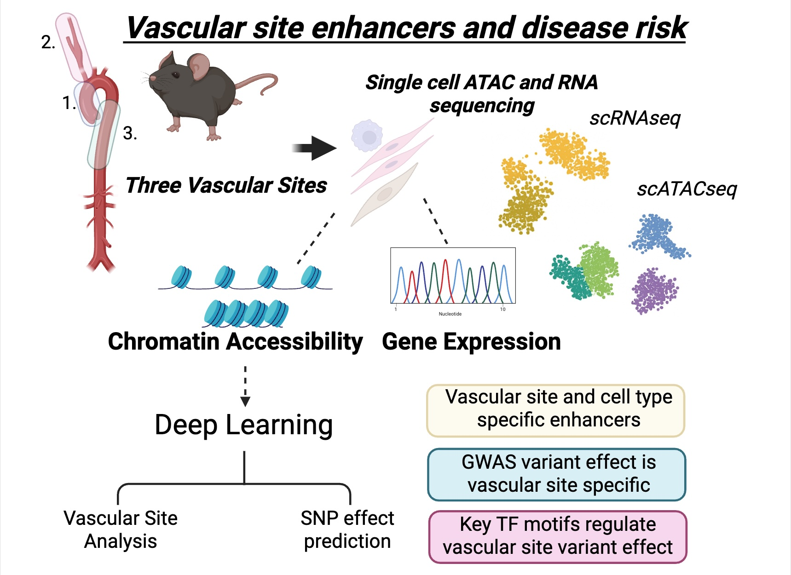

## Overview

We leverage human genetics to identify causal mechanisms of cardiovascular disease, then combine molecular biology, single-cell multi-omics, and mouse models to define how risk variants act in vascular cells—especially coronary artery smooth muscle.

---

## Research pillars

::: {.columns .v-center}
::: {.column width="30%"}
{width=100% fig-align="center"}
:::
::: {.column width="70%"}
### 1) ADAR1 RNA editing and dsRNA sensing in vascular disease
We study smooth muscle–specific ADAR1-mediated RNA editing, dsRNA accumulation, and activation of MDA5 (IFIH1) in atherosclerosis and vascular calcification.
:::
:::

::: {.columns .v-center}
::: {.column width="30%"}
{width=100% fig-align="center"}
:::
::: {.column width="70%"}
### 2) Epigenetic memory and vascular-bed specificity at single-cell resolution
We define how developmental origin and vascular bed shape cell states, epigenetic enhancers, and genetic risk mechanisms across human vascular disease.
:::
:::

::: {.columns .v-center}
::: {.column width="30%"}
{width=100% fig-align="center"}
:::
::: {.column width="70%"}
### 3) Functional genomics for mapping transcriptional network of dsRNA sensing and innate immune activation
We use CRISPRi screening with targeted Perturb-seq (TAP-seq) to map transcriptional networks of interferon stimulated gene (ISG) activation and dsRNA sensing in human coronary artery smooth muscle cells.
:::
:::

::: {.columns .v-center}
::: {.column width="30%"}
{width=100% fig-align="center"}
:::
::: {.column width="70%"}
### 4) Mouse genetics of smooth muscle transition and calcification
We dissect epigenetic and molecular mechanisms using conditional smooth muscle deletion models to connect genetics to disease phenotypes, including pathways involved in cell-state transition, inflammation, and vascular calcification.
:::
:::

---

## Example projects

Representative research directions in the lab include:

### ADAR1 and dsRNA sensing by MDA5 in vascular smooth muscle cells
We investigate how impaired A-to-I RNA editing by ADAR1 leads to activation of the innate immune sensor MDA5 in vascular smooth muscle cells during atherosclerosis. Using mouse models, single-cell genomics, and molecular approaches, we define how RNA editing regulates inflammatory activation, phenotypic switching, and plaque progression.

### Innate immune epigenetic memory in vascular cells
We study how transient inflammatory stimuli establish persistent epigenetic changes in vascular cells that influence long-term disease progression. This work integrates in vitro models, single-cell RNA-seq and ATAC-seq, and in vivo studies to define mechanisms of sustained immune activation and vascular memory.

### ADAR1 and MDA5 in fibroblast-smooth muscle communication
We examine how ADAR1 and MDA5 signaling pathways shape communication between adventitial fibroblasts and smooth muscle cells in atherosclerosis. By combining single-cell transcriptomics, ligand-receptor analysis, and functional perturbation, we aim to identify pathways driving pathogenic vascular remodeling.

### CRISPRi screens to define downstream regulatory networks of MDA5 activation
We use large pooled CRISPRi screens and targeted Perturb-seq approaches to identify genes and pathways that regulate MDA5 activation and downstream inflammatory signaling. These studies aim to uncover the broader regulatory networks controlling innate immune responses in vascular cells.

### Therapeutic targeting of dsRNA sensing pathways in atherosclerosis
We test whether modulation of MDA5 signaling can alter disease progression in atherosclerosis. Using genetic and pharmacologic approaches in preclinical models, this work seeks to establish dsRNA sensing pathways as candidate therapeutic targets in cardiovascular disease.

---

::: {.columns .v-center}

::: {.column width="60%"}

### RNA editing, double-stranded RNA sensing, and vascular disease

Across evolution, organisms have retained mechanisms to diversify RNA beyond the genomic sequence. One such mechanism is adenosine-to-inosine (A-to-I) RNA editing, catalyzed by ADAR enzymes. ADAR-mediated editing occurs primarily within double-stranded RNA (dsRNA) structures formed by repetitive and non-coding RNA elements.

A central function of ADAR1 is to suppress inappropriate innate immune activation. Through A-to-I editing, endogenous dsRNA is structurally modified to evade recognition by the dsRNA sensor MDA5 (*IFIH1*), preventing aberrant induction of type I interferon-stimulated gene (ISG) programs.

Human genetic studies have revealed that common variants regulate RNA editing frequency (edQTLs), and alleles associated with reduced editing are linked to increased risk of coronary artery disease and inflammatory disorders. These findings position RNA editing as a genetically controlled process with relevance to common disease.

Our work integrates human genetics with molecular biology to show that impaired RNA editing within vascular smooth muscle cells leads to accumulation of endogenous dsRNA, pathologic MDA5 activation, inflammatory phenotypic switching, and accelerated plaque progression. Together, these findings define endogenous RNA sensing as a causal mechanism of vascular disease.

*Recently reviewed by Weldy et al. ATVB, 2026 [Read the paper →](https://www.ahajournals.org/doi/10.1161/ATVBAHA.125.323847)* 

:::

::: {.column width="40%"}

{width=100% style="border-radius:8px; margin-bottom:1rem;"}
*ADAR1-mediated A-to-I editing suppresses endogenous dsRNA sensing by MDA5.*  

{width=100% style="border-radius:8px;"}
*Genetic regulation of RNA editing links dsRNA burden, MDA5 activation, and vascular disease risk.*

:::
:::

---

::: {.columns .v-center}

::: {.column width="60%"}

### Developmental and innate immune epigenetic memory in vascular disease

Vascular cells arise from distinct embryonic lineages, yet how developmental origin shapes adult disease susceptibility has remained poorly understood. In prior work, we defined a paradigm of **developmental epigenetic memory**, demonstrating that vascular smooth muscle cells, fibroblasts, and endothelial cells retain stable, lineage-specific chromatin accessibility patterns that persist into adulthood and influence disease-relevant gene programs.

Using integrated single-cell transcriptomic and epigenomic profiling, we showed that enhancer landscapes are not only cell type-specific, but also vascular site-specific, reflecting embryonic origin and governing how genetic variants regulate disease risk.

Building on this foundation, we are investigating how **innate immune activation interacts with and reshapes these epigenetic landscapes**. In particular, we study whether dsRNA sensing and interferon signaling induce persistent changes in chromatin accessibility, creating a second layer of acquired epigenetic memory in vascular cells.

By integrating developmental and inflammatory epigenetic programs, our goal is to define how vascular cells encode both lineage history and prior immune exposures to drive disease progression and identify opportunities to therapeutically reset maladaptive cellular memory.

:::

::: {.column width="40%"}

{
  width=100%
  style="border-radius:8px; margin-bottom:0.5rem;"
}

*Developmental origin shapes chromatin accessibility and enhancer landscapes that regulate gene expression and genetic disease risk in a vascular site-specific manner.*

:::

:::

---

## Featured publications

::: {.columns}
::: {.column width="33%"}
[{fig-align="center" width=90%}](https://doi.org/10.1038/s44161-025-00710-5)
:::

::: {.column width="67%"}
### Smooth muscle cell ADAR1 controls activation of RNA sensor MDA5 in atherosclerosis
**Weldy CS**, et al. *Nature Cardiovascular Research* (2025).  
PMID: 40958051 · DOI: 10.1038/s44161-025-00710-5

- **Cover**: October 2025 issue Nature Cardiovascular Research
- Finalist, **Louis N. and Arnold M. Katz Basic Science Research Prize** (AHA; Nov 16, 2024)
- [Highlighted by Stanford Department of Medicine News →](https://medicine.stanford.edu/news/current-news/standard-news/RNA-editing.html) 
- [Read the paper →](https://doi.org/10.1038/s44161-025-00710-5)

:::
:::

::: {.columns}
::: {.column width="33%"}
[{fig-align="center" width=90%}](https://doi.org/10.1038/s44320-025-00140-2)
:::

::: {.column width="67%"}
### Epigenomic landscape of single vascular cells reflects developmental origin and disease risk loci
**Weldy CS**, et al. *Molecular Systems Biology* (2025).  
PMID: 40931195 · DOI: 10.1038/s44320-025-00140-2

- **Cover**: November 2025 issue Molecular Systems Biology
- [Highlighted by the Stanford Cardiovascular Institute →](https://med.stanford.edu/cvi/mission/news_center/articles_announcements/2025/developmental-memory.html)
- [Read the paper →](https://doi.org/10.1038/s44320-025-00140-2)

:::
:::

---

## In the news

::: {.columns .v-center}
::: {.column width="25%"}
[{width=100% style="border-radius:8px;"}](news/2024-11-16-stanford-medicine-rna-editing.html)
:::
::: {.column width="75%"}
### Stanford Medicine highlights our RNA editing work
A Stanford Medicine feature on ADAR1 RNA editing, dsRNA sensing, and implications for cardiovascular disease mechanisms.  
[Read the story →](news/2024-11-16-stanford-medicine-rna-editing.html)
:::
:::

::: {.columns .v-center}
::: {.column width="25%"}
[{width=100% style="border-radius:8px;"}](news/2025-12-15-developmental-memory-arteries.html)
:::
::: {.column width="75%"}
### Stanford CVI story on developmental “memory” in arteries
How developmental origin leaves a lasting imprint shaping regional vascular disease risk.  
[Read the story →](news/2025-12-15-developmental-memory-arteries.html)
:::
:::
